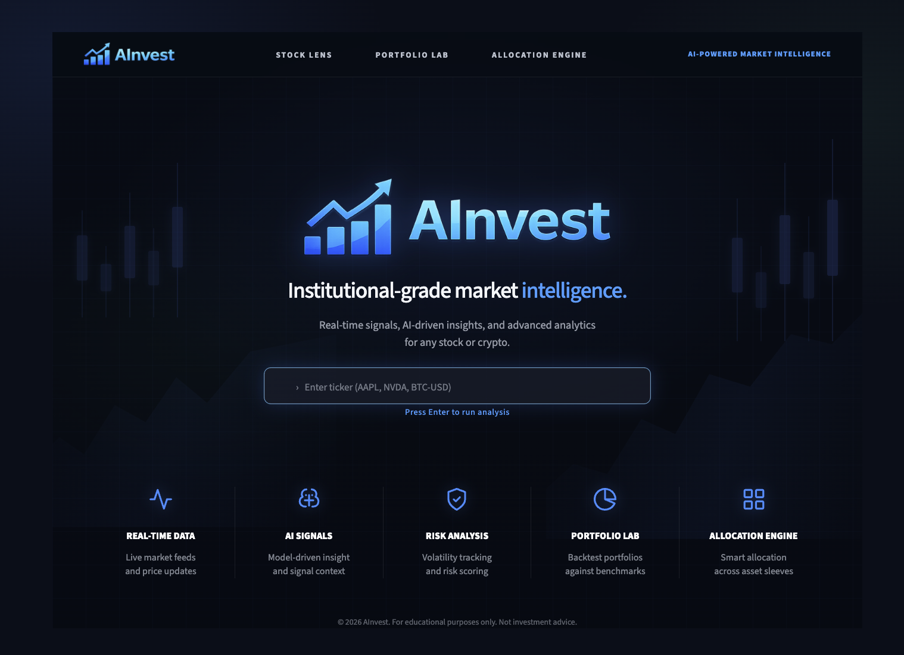
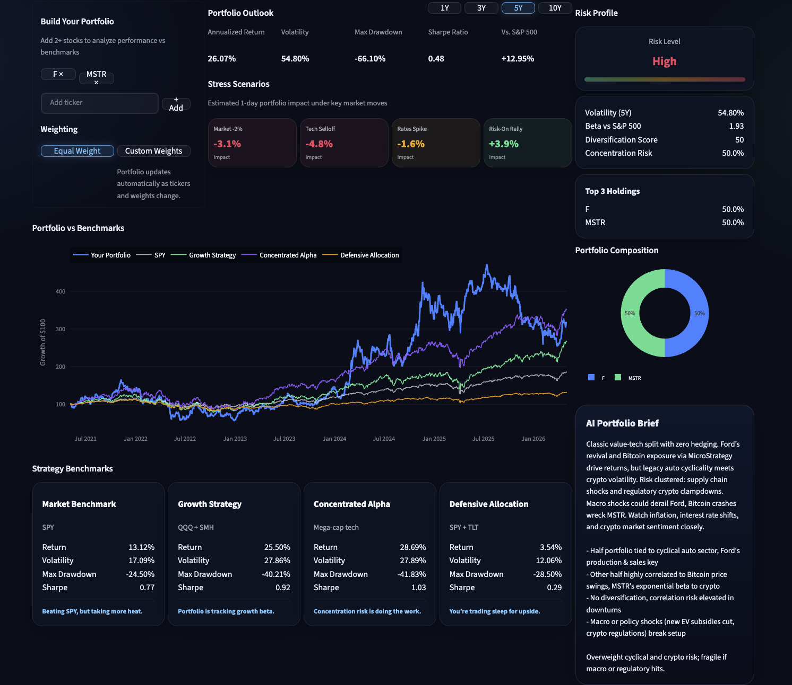
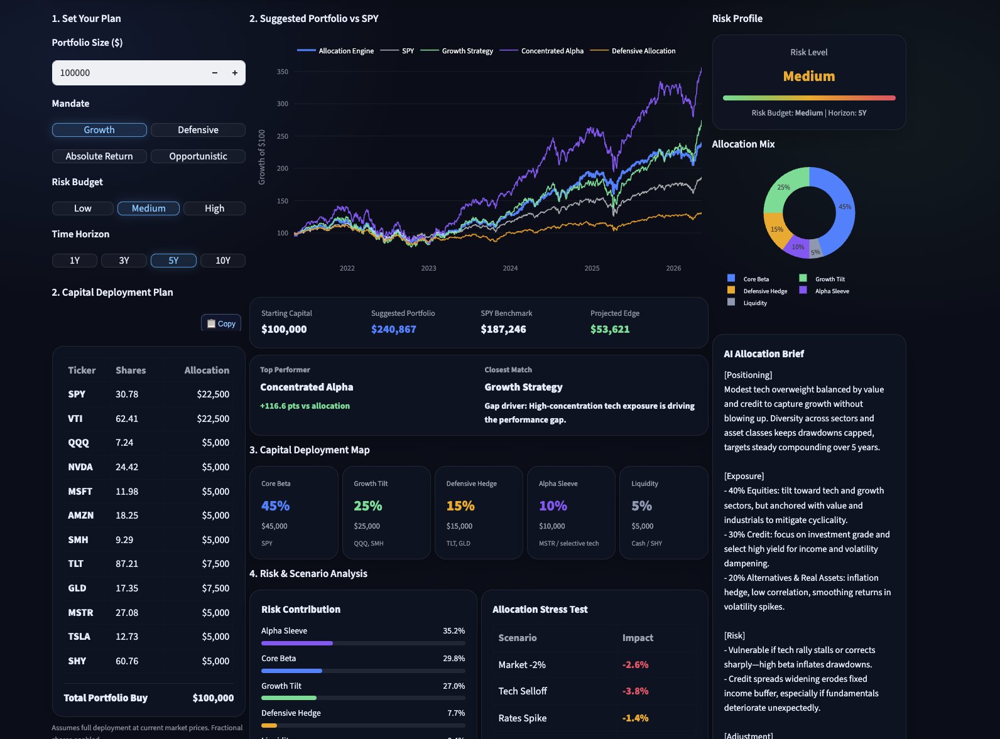

# 🚀 AInvest

Institutional-style financial intelligence and portfolio decision platform built to simulate how modern quantitative firms structure market signals, macro regimes, portfolio construction, and probabilistic risk analysis into a unified investment workflow.

AInvest combines quantitative analytics, simulation systems, AI reasoning, and real-time market data into an integrated decision engine.

---

## 🌐 Live App
👉 https://ainvest-8zkq.onrender.com/

---

## 🖼 System Preview

---

## 🔍 Stock Lens

---

## 📊 Portfolio Lab

---
## ⚙️ Allocation Engine

## ⚡ What This Is

Most retail platforms show charts.

AInvest builds decision systems.

It sits between:

- real-time market data  
- quantitative signals  
- macro regime analysis  
- portfolio construction  
- probabilistic simulation  
- AI interpretation  

and transforms them into a unified, institutional-style investment intelligence workflow.

The platform is designed to simulate how modern quantitative firms structure:

- market regime positioning  
- portfolio allocation  
- risk management  
- scenario analysis  
- capital deployment decisions  

into clear, decision-ready output.
---

## 🧩 Core Features

### 🔍 Stock Lens
Single-ticker analysis engine:

- Signal (Bullish / Neutral / Bearish)
- Conviction score
- Risk level
- AI trader-style insight
- Real-time price + structure

---

# ⚙️ Allocation Engine

Advanced capital allocation and portfolio construction workspace built for institutional-style analysis.

Dynamic portfolio construction based on:

- mandate: growth, defensive, absolute return, opportunistic

- risk budget

- time horizon

- portfolio size

Automatically generates:

- capital deployment plan: ticker, shares, dollars, strategy sleeve

- portfolio allocation map

- projected return, volatility, drawdown, Sharpe ratio, and SPY outperformance

- benchmark comparison against:

  - SPY

  - Growth Strategy

  - Concentrated Alpha

  - Defensive Allocation

Integrated analytical engines:

- Monte Carlo Engine

- Risk Engine

- Stress Test Engine

- Factor Exposure Engine

- Correlation Engine

- Scenario Engine

- Market Regime Engine

- AI Insights

- AI Recommendations Layer

Advanced analytics:

- live price-based position sizing

- risk contribution breakdown by allocation sleeve

- recession, inflation, rates shock, tech selloff, credit crunch, and bull market stress testing

- factor exposure analysis across:

  - market beta

  - size

  - value

  - momentum

  - quality

  - low volatility

  - growth

- correlation heatmap for overlap and diversification analysis

- custom macro scenario builder for GDP, inflation, rates, and equity shocks

- portfolio health scoring

- strategic sleeve exposure visualization

AI layer:

- AI executive summary

- PM-style allocation brief

- desk-style portfolio interpretation

- exposure, positioning, adjustment, and risk commentary

👉 Transforms AInvest from a stock analysis dashboard into a multi-engine portfolio intelligence platform.

---

### 📊 Portfolio Lab (NEW)
Multi-asset portfolio analysis system:

- Add multiple tickers dynamically
- Equal weight or custom weighting
- Portfolio-level metrics:
  - Return
  - Volatility
  - Sharpe
  - Max drawdown
- Benchmark comparison (SPY + strategies)
- Stress scenario simulation
- AI portfolio brief (PM-style insight)

👉 This is the foundation for portfolio intelligence tooling, not just stock analysis.

---
## 🧠 System Architecture

AInvest operates as a layered financial intelligence pipeline designed to simulate institutional-style investment workflows.

### 1. Market Data Layer
Handles live financial data ingestion and preprocessing.

Responsibilities:
- Real-time market data retrieval
- Portfolio benchmark construction
- Historical return normalization
- Data cleaning + fallback handling
- Defensive runtime safeguards

Sources:
- yfinance
- PostgreSQL ranked datasets
- Precomputed cloud allocation pipelines

---

### 2. Quantitative Signal Layer
Transforms raw market data into structured portfolio and market signals.

Capabilities:
- Directional bias generation
- Conviction scoring
- Risk classification
- Relative strength analysis
- Allocation ranking models
- Cross-asset signal evaluation
- Regime transition analysis

Outputs:
- bullish / neutral / bearish bias
- portfolio bucket weights
- macro regime classification
- stress indicators
- factor exposure metrics

---

### 3. Portfolio Intelligence Layer
Performs portfolio construction and institutional-style analytics.

Systems include:
- Allocation Engine
- Portfolio Lab
- Risk Engine
- Stress Test Engine
- Correlation Engine
- Factor Exposure Engine
- Monte Carlo simulation framework

Capabilities:
- capital deployment modeling
- benchmark comparison
- volatility analysis
- drawdown forecasting
- probabilistic scenario simulation
- tail-risk evaluation
- survivability testing

---

### 4. AI Reasoning Layer
LLMs interpret quantitative outputs into structured investment narratives.

AI-generated outputs include:
- trader-style signal interpretation
- PM-style portfolio briefs
- macro desk commentary
- scenario interpretation
- allocation rationale
- risk observations

→ Converts quantitative outputs into human-readable financial intelligence.

---

### 5. Presentation Layer
Institutional-style decision interface built in Streamlit.

Design principles:
- decision-first workflows
- modular analytical engines
- macro terminal aesthetic
- high-density information layout
- portfolio manager style presentation

The interface is designed to resemble modern internal investment research and portfolio systems rather than traditional retail dashboards.
## ☁️ Cloud Infrastructure & Data Pipeline (NEW)

AInvest now operates on a cloud-backed architecture designed for scalable financial computation workflows.

### Infrastructure Upgrades
- PostgreSQL database integration (Render)
- Autonomous cron-based ranking pipeline
- Persistent cloud storage for ranked candidates
- Background precomputation of allocation datasets
- Environment-based secret management
- Auto-deploy CI workflow through GitHub + Render

### Ranking Pipeline
The allocation engine no longer computes all market rankings on-demand.

Instead:
1. A scheduled cloud cron job scans and ranks securities
2. Rankings are stored in PostgreSQL
3. The UI retrieves precomputed datasets instantly
4. Allocation Engine consumes ranked candidates in real time

This architecture significantly improves:
- response speed
- scalability
- reliability
- separation of compute vs presentation layers

### Reliability Engineering
Recent upgrades introduced:
- ticker failure handling
- defensive runtime safeguards
- fallback-ready data architecture
- production bug tracking / hotfix workflow
- groundwork for future multi-provider market data routing

👉 These upgrades move AInvest closer to a real-world fintech systems architecture rather than a simple dashboard application.

---

## 🔁 End-to-End Flow

1. User inputs ticker(s)  
2. Signal engine evaluates position  
3. Market data is retrieved  
4. AI generates context + reasoning  
5. Unified output is displayed  

---

## ✨ Capabilities

- 📊 Quant-style signal generation  
- 🧠 AI interpretation layer  
- 📉 Portfolio analytics + benchmarking  
- ⚡ Real-time processing  
- 🛡 Resilient data handling  

---

## 🛠 Tech Stack

- Python
- Streamlit
- Pandas / NumPy
- yfinance
- OpenAI API
- Plotly

---

## 🛡️ Security & Reliability

- API keys are stored securely using Streamlit secrets / environment variables
- No API keys or secrets are hardcoded in the codebase
- Basic request rate limiting helps prevent rapid API abuse
- OpenAI spend alerts are configured to monitor usage
- External API calls use defensive error handling to prevent app crashes
- Market data fallback logic helps keep the UI stable during data issues

## 🚀 Running Locally

bash git clone https://github.com/dane-anderson/ainvest.git cd ainvest pip install -r requirements.txt streamlit run app.py 

Create a .streamlit/secrets.toml:

toml OPENAI_API_KEY = "your-key-here" 

---

## 🚀 Deployment

Deployed on Render:

- Auto-deploy from GitHub
- Python web service
- Streamlit app entry: app.py

---
## ⚠️ Design Philosophy

AInvest is not built to predict markets with certainty.

It is built to:

> structure uncertainty into interpretable, probabilistic decision frameworks.

The platform focuses on:
- signal interpretation over prediction
- risk-aware portfolio construction
- macro regime identification
- probabilistic simulation
- scenario-driven analysis
- institutional-style decision support

Rather than generating isolated indicators, AInvest attempts to combine:

- quantitative analytics
- portfolio intelligence
- macro positioning
- simulation systems
- AI reasoning

into a unified investment workflow designed to resemble modern institutional research and portfolio systems.

---

## 🔮 Future Expansion

Planned expansion areas include:

- Advanced portfolio optimization systems
- Multi-timeframe signal aggregation
- Dynamic factor rotation models
- Beta / factor exposure decomposition
- Cross-asset macro correlation engines
- AI-assisted portfolio rebalancing
- Adaptive regime transition forecasting
- Probabilistic risk scoring systems
- Multi-provider market data routing
- Cloud-based precomputed ranking infrastructure
- Autonomous AI research agents
- Institutional watchlists + alert systems
- Scenario tree simulation frameworks
- Expanded Monte Carlo stress architectures
- Custom portfolio mandate creation
- AI-generated investment memos and research reports

Long-term vision:
- evolve AInvest from a financial dashboard into a full investment intelligence operating system.

## 💡 Vision

AInvest represents a shift from:

> dashboards → decision systems

The goal is to build tools that:

- ingest complex financial data  
- reason over it  
- output clear, actionable insight  

similar to internal tools used at quantitative firms.

---

## ⚠️ Disclaimer

For educational purposes only. Not financial advice
