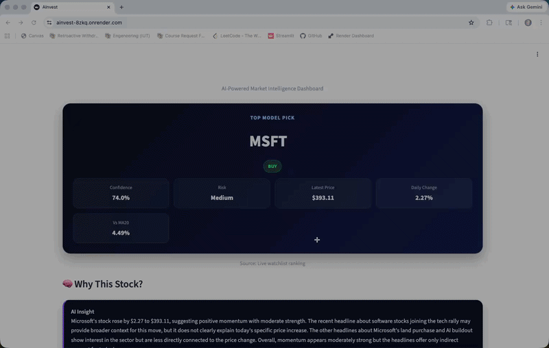

# 🚀 AInvest

AI-powered stock insight engine that turns market data into clear, actionable insights using model signals, real-time data, and AI explanations.

---

## 🚀 Live App

👉 https://ainvest.onrender.com

---

## 🎬 Demo

---

## 🧠 What It Does

AInvest combines quantitative signals, live market data, and AI-generated explanations to help users quickly understand stock opportunities.

---

## 🧠 Overview

Most stock tools provide raw numbers.

AInvest explains them.

The system integrates:

- Model-generated signals (buy/hold + confidence)  
- Real-time market data with fallback handling  
- AI-generated natural language explanations  

This creates a simplified, user-friendly experience for understanding complex financial data.

---

## ✨ Features

- 📈 Model-based stock signals with confidence scores  
- 🔁 Real-time data + fallback system  
- 🧠 AI-generated explanations for each stock  
- 🎨 Clean and intuitive user interface  
- ⚡ Fast and lightweight deployment  

---

## ⚙️ How It Works

1. User enters a stock ticker  
2. Model generates a buy/hold signal with confidence  
3. App fetches real-time data (or fallback dataset if needed)  
4. AI generates a human-readable explanation  
5. Results are displayed in a clean dashboard  

---

## 🛠 Tech Stack

- Python  
- Streamlit  
- Pandas  
- OpenAI API (AI explanations)  
- Financial data APIs  

---

## 📊 Example Output

Stock-level insight including:

- Model signal (buy/hold)  
- Confidence score  
- Current market data  
- AI-generated explanation  

---

## ⚠️ Disclaimer

This tool is for informational purposes only and does not constitute financial advice.

---

## 🚀 Future Improvements

- Portfolio tracking and analysis  
- Multi-stock comparison  
- Improved model accuracy  
- Context-aware AI explanations  

---

## 💡 Vision

AInvest is designed to simulate real-world fintech systems by combining data pipelines, model outputs, and AI reasoning into a single application.

The long-term goal is to build intelligent financial tools that translate complex data into clear, actionable insights.
