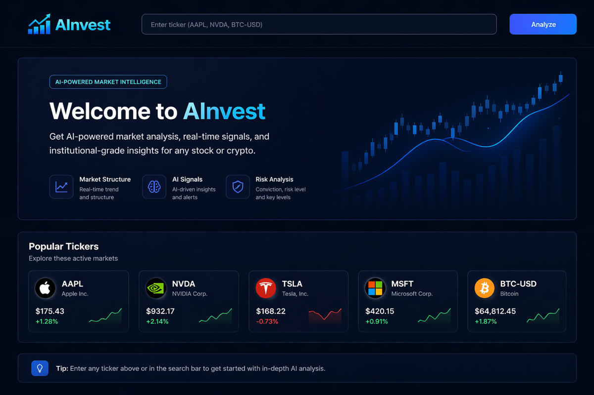

# 🚀 AInvest

AI-powered stock decision engine that transforms raw market data into clear, actionable insights using quantitative signals, real-time data, and AI reasoning.

---

## 🌐 Live App
👉 https://ainvest-8zkq.onrender.com/

---

## 🖼 Preview

---

## 🧠 What It Does

AInvest doesn’t just show stock data — it **interprets it**.

It combines:
- Quantitative model signals (buy/hold + confidence)
- Real-time market data with fallback handling
- AI-generated explanations

→ Turning complex financial data into simple, readable insights.

---

## ⚙️ How It Works

1. User enters a stock ticker  
2. Model generates a signal + confidence score  
3. App fetches real-time data (with fallback system)  
4. AI generates a natural language explanation  
5. Results are displayed in a clean dashboard  

---

## ✨ Features

- 📈 Model-based signals with confidence scoring  
- 🔁 Real-time + fallback data pipeline  
- 🧠 AI-generated explanations (OpenAI)  
- 🎨 Clean, minimal UI  
- ⚡ Fast deployment on Render  

---

## 🛠 Tech Stack

- Python  
- Streamlit  
- Pandas  
- OpenAI API  
- Financial data APIs  

---

## ⚠️ Disclaimer

For informational purposes only. Not financial advice.

---

## 🚀 Roadmap

- Portfolio tracking  
- Multi-stock comparison  
- Improved model accuracy  
- Context-aware AI reasoning  

---

## 💡 Vision

AInvest simulates real-world fintech systems by combining:
- Data pipelines  
- Model outputs  
- AI reasoning  

into a single decision engine.

The goal is to build tools that **translate complexity into clarity**.
